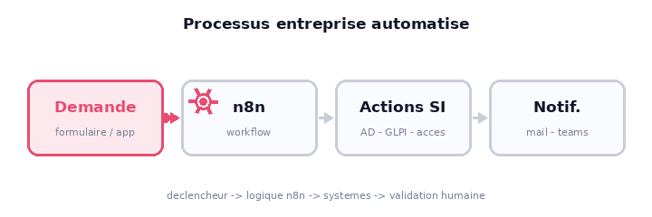

<p align="center">
  
</p>

<h1 align="center">n8n for entreprise</h1>

<p align="center">
  <b>Templates d'automatisation n8n pour les processus metier de l'entreprise.</b><br>
  Workflows prets a importer, codes et documentes — onboarding/offboarding IT,<br>
  notifications, validations humaines, intégrations internes.
</p>

<p align="center">
   workflow n8n -> actions systemes -> notification" width="600">
</p>

---

## Pourquoi ce repo

Chaque dossier contient un **template complet** pour un besoin d'automatisation
recurrent en entreprise :

- 📄 **workflow n8n exporte** (`workflow-n8n.json`, importable en 1 clic)
- 💻 **app / front de declenchement** quand c'est utile (HTML/JS statique)
- 📝 **README dedie** avec les fonctionnalites, le payload attendu et les etapes
  de configuration (credentials, API internes a brancher)

Les etapes sensibles (AD, GLPI, partages, mail…) sont volontairement des
**nodes HTTP desactives avec URLs placeholder** : chaque équipe les configure avec ses
propres systemes, sans toucher a la logique du workflow.

## Installer n8n

Installation instantanée avec le script officiel (Docker requis) :

```sh
curl -fsSL https://get.n8n.io | sh
```

Manuellement avec Docker :

```sh
docker volume create n8n_data
docker run -it --rm --name n8n -p 5678:5678 -v n8n_data:/home/node/.n8n docker.n8n.io/n8nio/n8n
```

→ Editeur sur <http://localhost:5678>

- 📚 Installation & docs : <https://docs.n8n.io/hosting/>
- ☁️ Alternative sans installation : [n8n Cloud](https://app.n8n.cloud/signup)

## Utiliser un template

1. Installer n8n (ci-dessus) puis ouvrir l'editeur.
2. **Workflows → Import from File** → choisir le `workflow-n8n.json` du template.
3. Suivre le README du template : creer les **credentials** requis (les IDs de
   credentials ne sont pas exportes), configurer les URLs des API internes,
   activer les nodes, puis **publier** le workflow pour que le webhook reponde.

## Contribuer

- Un dossier = un template autonome (`README.md` + workflow exporte + front eventuel).
- **Aucun secret en dur** : tokens/API keys uniquement via le systeme de credentials n8n.
- Exports workflows sanitises (IDs de credentials retires si possible).

## Licence

Les workflows de ce repo sont sous licence **Sustainable Use License** de n8n —
usage interne/automatisation autorise, revente interdite :
<https://github.com/n8n-io/n8n/blob/master/LICENSE.md>
